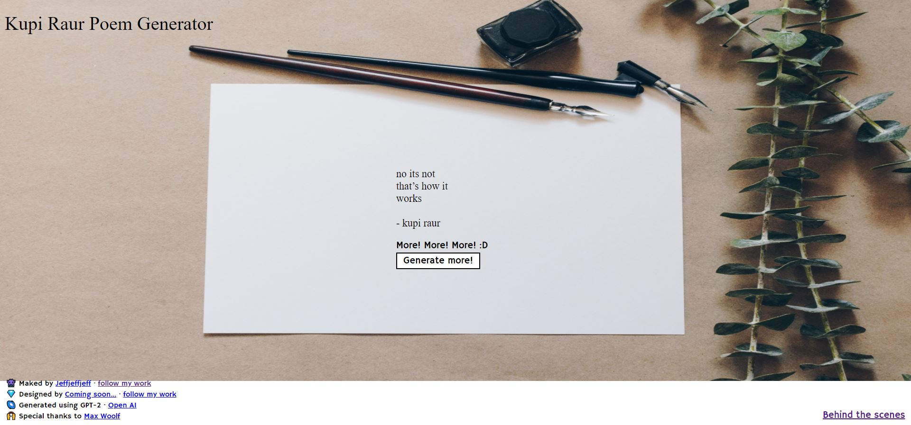

# kupiraur.github.io

An experimental website on github featuring poems generated using GPT-2 after training on Rupi Kaur's Milk and Honey.

## Demo
https://jeffreytjs.github.io/kupiraur.github.io/

## Features
- Generate pseudo-poems.
- Read at pseudo-poems.
- ???
- Profit.
